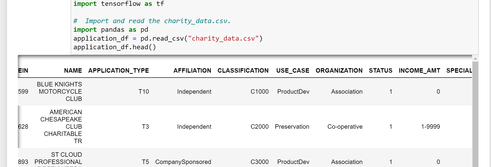
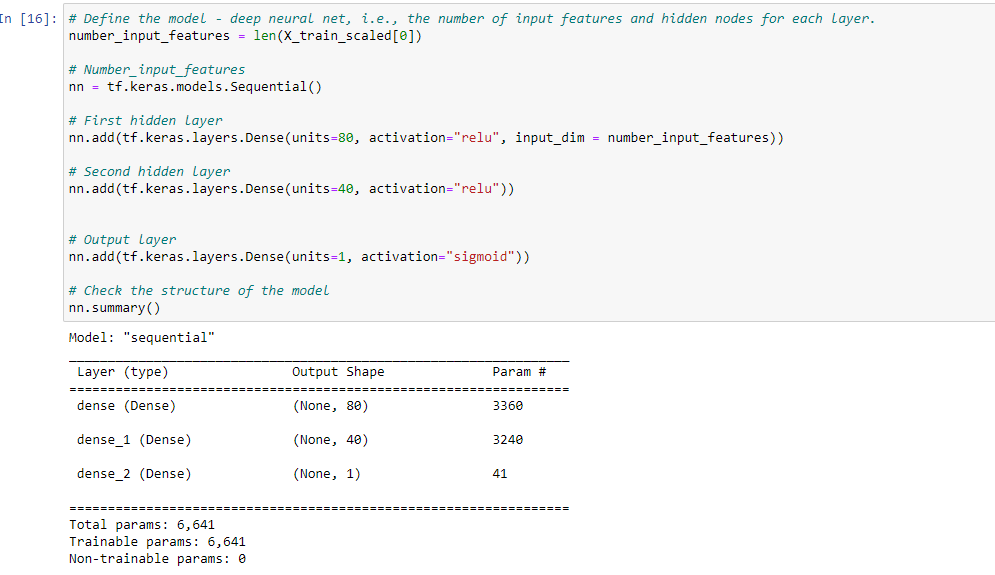
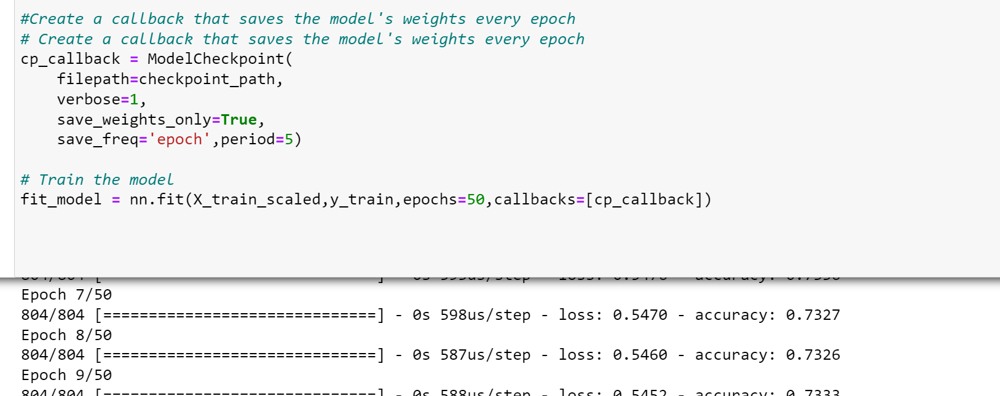
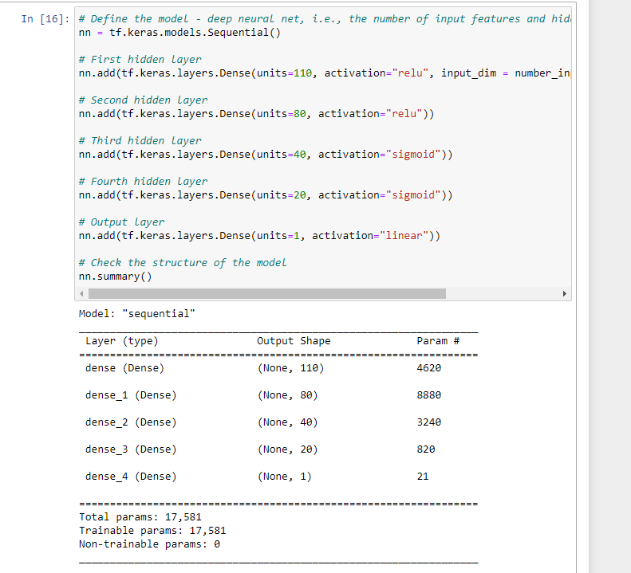
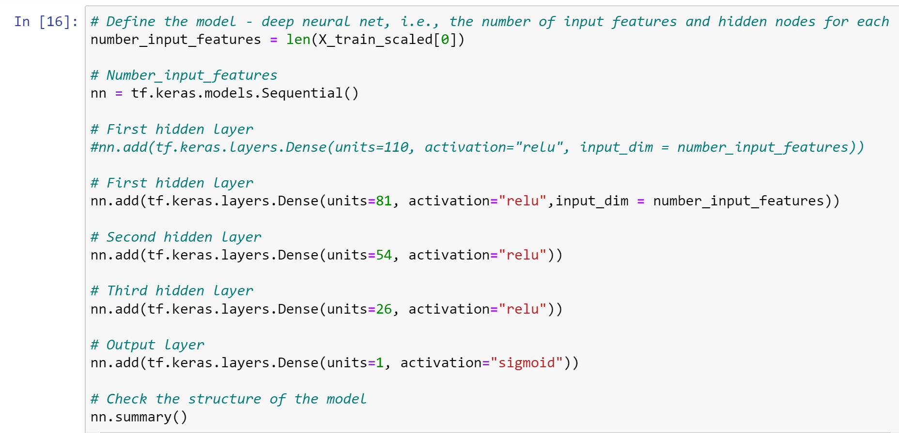
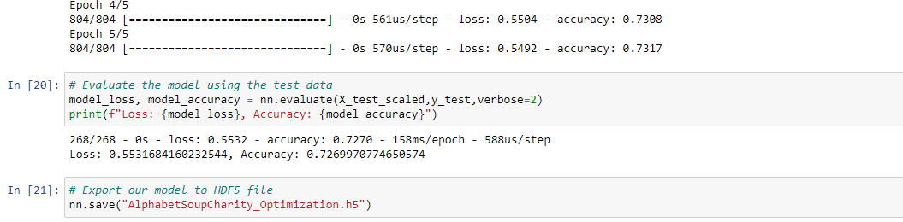
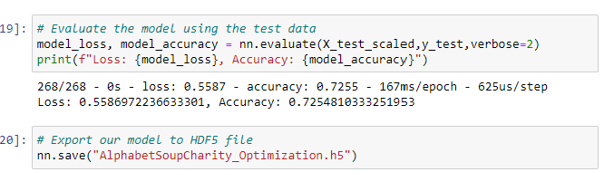
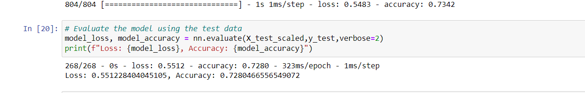

# Neural_Network_Charity_Analysis

## Overview

The purpose of the project is to help a foundation to predict where to make investments.With the knowledge of machine learning and neural networks, we will apply features in the provided dataset to create a binary classifier that is capable of predicting whether the applicants will be successful if funded by Alphabet Soup. The received data has 34,000 organizations and a number of columns that capture metadata about each organization.

###	Data Preprocessing

o	What variable(s) are considered the target(s) for your model?
o	The target variable for the model was the “IS_SUCCESSFUL.” Column. 

o	What variable(s) are considered to be the features for your model?
o	The initial model considered following columns as features:
o	EIN, NAME, APPLICATION_TYPE, AFFILIATION, CLASSIFICATION, USE_CASE, ORGANIZATION, STATUS, INCOME_AMT, SPECIAL_CONSIDERATIONS, ASK_AMT, IS_SUCCESSFUL.

o	What variable(s) are neither targets nor features, and should be removed from the input data?

o	The EIN and NAME columns were removed because those columns will not increase the accuracy of the model.

### Compiling, Training, and Evaluating the Model

o	How many neurons, layers, and activation functions did you select for your neural network model, and why?

o	TensorFlow Karas Sequential model was used as the Neural Network Model. In optimized model layer1 started with 80 neurons and for layer 2, 40 neurons were included in respectively and activation functions were set to ‘relu’,and ’sigmoid’ for output layer.

#### Resubmit
 Resubmitted the missing codes for a callback that saves the model's weights every 5 epochs and rename folders with resubmit tag.

o	In second attempt, hidden layers increased to 4 layers instead of 2 and layer 1started with 110 neurons; layer 2 with 80 neurons; layer 3 with 40 neurons and layer 4 with 20 neurons. The activation functions selected were ‘relu’ (for layer1& layer2);’sigmoid’ (for layer 3 & layer4); ‘linear’ for output layer.

o	In third attempt, layer1 started with 81 neurons and for layer 2, 54 neurons and layer 3 with 26 neurons were included in respectively. From there, the relu and sigmoid activation functions seemed to be better fit for layers; so set layer 1,layer 2,layer 3 to ‘relu’,’sigmoid’ for output layer.

o	Were you able to achieve the target model performance?
o	The target for the model mentioned was 75% , but the best the model could produce was 72.8%.

  #### Attempt 1
  
  
  
 #### Attempt 2
 
  
  
  
  
   
 #### Attempt 3
  
   
 
#### Resubmit final result

o	What steps did you take to try and increase model performance?

o	Columns reviewed and the columns STATUS AND SPECIAL_CONSIDERATIONS  were dropped.

o	Tried to format the column INCOME_AMT to same format.

o	Increased the number of neurons and layers.

o	The linear activation was tried, not improved the accuracy.

## Summary
o	The best accuracy model produced was 73% using relu and sigmoid activation functions. 

o	Since it is a classification problem and so it is a regression problem. So, we can use Logistic Regression as an alternative model.

  
